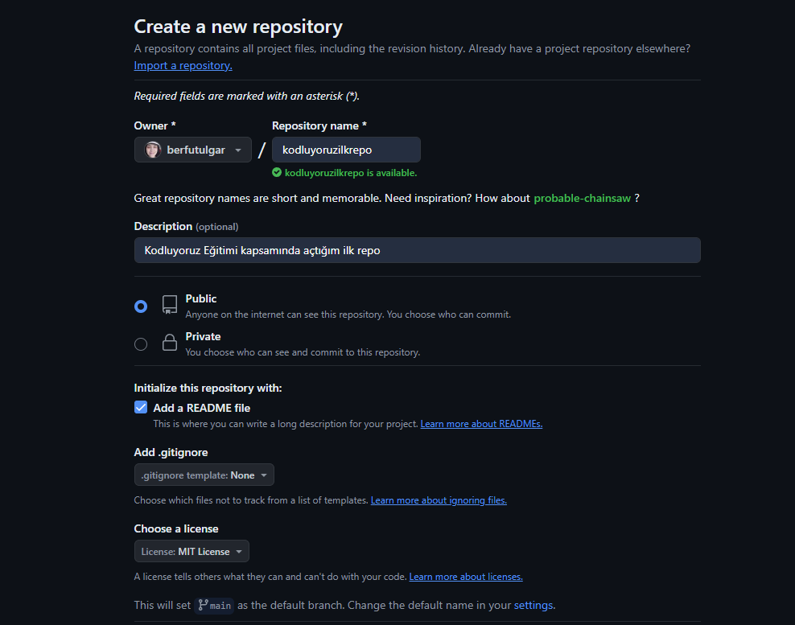

# Kodluyoruz Ilk Repo

Bu repo [Kodluyoruz](https://www.kodluyoruz.org) Front-End Eğitiminde oluşturduğumuz ilk repo. İçerisinde bir adet README dosyası, bir adet de index.html barındırıyor.



## Installation
 
 Öncelikle projeyi clonelayın. (Buraya sizin reponuzdan aldığınız link gelecek)

```bash
 git clone https://github.com/berfutulgar/kodluyoruzilkrepo.git
```
## Usage

Projeyi cloneladıktan sonra Visual Studio Code programında açınız.

Linux içinÇ
```linux
cd kodluyoruzilkrepo
code .
```
## Contributing

Pull requestler kabul edlir. Büyk değişiklikler için, önce neyi değiştirmek istediğinizi tartışmak için bir konu açınız.

## License

[MIT](https://choosealicense.com/licenses/mit/)